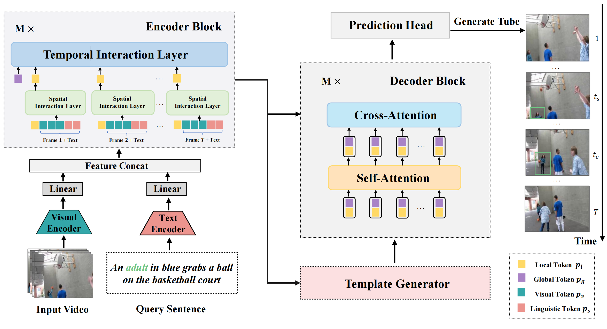

# Embracing Consistency: A One-Stage Approach for Spatio-Temporal Video Grounding
NeurIPS 2022, Spotlight Presentation, [[`arXiv`](https://arxiv.org/abs/2209.13306)] [[`BibTeX`](#Citing)]

### Introduction
We propose STCAT, a new one-stage spatio-temporal video grounding method, which achieved state-of-the-art performance on [VidSTG](https://github.com/Guaranteer/VidSTG-Dataset) and [HC-STVG](https://github.com/tzhhhh123/HC-STVG) benchmarks. This repository provides the Pytorch Implementations for the model training and evaluation. For more details, please refer to our [paper](https://arxiv.org/abs/2209.13306).

<div align="center">
  
</div><br/>

## Dataset Preparation
The used datasets are placed in `data` folder with the following structure.
```
data
|_ vidstg
|  |_ videos
|  |  |_ [video name 0].mp4
|  |  |_ [video name 1].mp4
|  |  |_ ...
|  |_ vstg_annos
|  |  |_ train.json
|  |  |_ ...
|  |_ sent_annos
|  |  |_ train_annotations.json
|  |  |_ ...
|  |_ data_cache
|  |  |_ ...
|_ hc-stvg
|  |_ v1_video
|  |  |_ [video name 0].mp4
|  |  |_ [video name 1].mp4
|  |  |_ ...
|  |_ annos
|  |  |_ hcstvg_v1
|  |  |  |_ train.json
|  |  |  |_ test.json
|  |  data_cache
|  |  |_ ...
```

You can prepare this structure with the following steps:

**VidSTG**
* Download the video for VidSTG from the [VidOR](https://xdshang.github.io/docs/vidor.html) and put it into `data/vidstg/videos`. The original video download url given by the VidOR dataset provider is broken. You can download the VidSTG videos from [this](https://disk.pku.edu.cn/link/AA93DEAF3BBC694E52ACC5A23A9DC3D03B).
* Download the text and temporal annotations from [VidSTG Repo](https://github.com/Guaranteer/VidSTG-Dataset) and put it into `data/vidstg/sent_annos`.
* Download the bounding-box annotations from [here](https://disk.pku.edu.cn/link/AA9BD598C845DC43A4B6A0D35268724E4B) and put it into `data/vidstg/vstg_annos`.
* For the loading efficiency, we provide the dataset cache for VidSTG at [here](https://disk.pku.edu.cn/link/AAA0FA082DEB3D47FCA92F3BF8775EA3BC). You can download it and put it into `data/vidstg/data_cache`. 

**HC-STVG**
* Download the version 1 of HC-STVG videos and annotations from [HC-STVG](https://github.com/tzhhhh123/HC-STVG). Then put it into `data/hc-stvg/v1_video` and `data/hc-stvg/annos/hcstvg_v1`.
* For the loading efficiency, we provide the dataset cache for HC-STVG at [here](https://disk.pku.edu.cn/link/AA66258EA52A1E435B815C4BC10E88925D). You can download it and put it into `data/hc-stvg/data_cache`. 

## Setup

### Requirements

The code is tested with PyTorch 1.10.0. The other versions may be compatible as well. You can install the requirements with the following commands:

```shell
conda install pytorch==1.10.0 torchvision==0.11.0 torchaudio==0.10.0 cudatoolkit=11.3 -c pytorch -c conda-forge
pip install -r requirements.txt
```
Then, download [FFMPEG 4.1.9](https://ffmpeg.org/download.html) and add it to the `PATH` environment variable for loading the video.

### Pretrained Checkpoints

Our model leveraged the ResNet-101 pretrained by MDETR as the vision backbone. Please download the pretrained weight from [here](https://github.com/ashkamath/mdetr) and put it into `data/pretrained/pretrained_resnet101_checkpoint.pth`.


## Usage

> Note: You should use one video per GPU during training and evaluation, more than one video per GPU is not tested and may cause some bugs.

### Training
For training on an 8-GPU node, you can use the following script:
```shell
# run for VidSTG
python3 -m torch.distributed.launch \
 --nproc_per_node=8 \
 scripts/train_net.py \
 --config-file "experiments/VidSTG/e2e_STCAT_R101_VidSTG.yaml" \
 --use-seed \
 OUTPUT_DIR data/vidstg/checkpoints/output \
 TENSORBOARD_DIR data/vidstg/checkpoints/output/tensorboard \
 INPUT.RESOLUTION 448

# run for HC-STVG
python3 -m torch.distributed.launch \
 --nproc_per_node=8 \
 scripts/train_net.py \
 --config-file "experiments/HC-STVG/e2e_STCAT_R101_HCSTVG.yaml" \
 --use-seed \
 OUTPUT_DIR data/hc-stvg/checkpoints/output \
 TENSORBOARD_DIR data/hc-stvg/checkpoints/output/tensorboard \
 INPUT.RESOLUTION 448
```
For more training options (like using other hyper-parameters), please modify the configurations `experiments/VidSTG/e2e_STCAT_R101_VidSTG.yaml` and `experiments/HC-STVG/e2e_STCAT_R101_HCSTVG.yaml`.

### Evaluation
To evaluate the trained STCAT models, please run the following scripts:

```shell
# run for VidSTG
python3 -m torch.distributed.launch \
 --nproc_per_node=8 \
 scripts/test_net.py \
 --config-file "experiments/VidSTG/e2e_STCAT_R101_VidSTG.yaml" \
 --use-seed \
 MODEL.WEIGHT data/vidstg/checkpoints/stcat_res448/vidstg_res448.pth \
 OUTPUT_DIR data/vidstg/checkpoints/output \
 INPUT.RESOLUTION 448

# run for HC-STVG
python3 -m torch.distributed.launch \
 --nproc_per_node=8 \
 scripts/test_net.py \
 --config-file "experiments/HC-STVG/e2e_STCAT_R101_HCSTVG.yaml" \
 --use-seed \
 MODEL.WEIGHT data/hc-stvg/checkpoints/stcat_res448/hcstvg_res448.pth \
 OUTPUT_DIR data/hc-stvg/checkpoints/output \
 INPUT.RESOLUTION 448
```

## Model Zoo
We provide our trained checkpoints with ResNet-101 backbone for results reproducibility.

| Dataset | resolution | url | Declarative (m_vIoU/vIoU@0.3/vIoU@0.5) | Interrogative (m_vIoU/vIoU@0.3/vIoU@0.5) | size |
|:----:|:-----:|:-----:|:-----:|:-----:|:-----:|
| VidSTG | 416 | [Model](https://disk.pku.edu.cn/link/AA2C0A9412722B47FBA3C67FE3314FEAA4)  | 32.94/46.07/32.32 | 27.87/38.89/26.07 | 3.1GB |
| VidSTG | 448 | [Model](https://disk.pku.edu.cn/link/AA1337478438D4457DAD8FEF817234A04E)  | 33.14/46.20/32.58 | 28.22/39.24/26.63 | 3.1GB |

| Dataset | resolution | url | m_vIoU/vIoU@0.3/vIoU@0.5 | size |
|:----:|:-----:|:-----:|:-----:|:-----:|
| HC-STVG | 416 | [Model](https://disk.pku.edu.cn/link/AAE483531815CE4F2484BB5B0A68ED060C)  | 34.93/56.64/31.03 |3.1GB |
|  HC-STVG | 448 | [Model](https://disk.pku.edu.cn/link/AA51A4119F8AA843BEB2B7EC03FEFA82A5)  | 35.09/57.67/30.09 |3.1GB |


## Acknowledgement
This repo is partly based on the open-source release from [MDETR](https://github.com/ashkamath/mdetr), [DAB-DETR](https://github.com/IDEA-Research/DAB-DETR) and [MaskRCNN-Benchmark](https://github.com/facebookresearch/maskrcnn-benchmark). The evaluation metric implementation is borrowed from [TubeDETR](https://github.com/antoyang/TubeDETR) for a fair comparison.

## License
`STCAT` is released under the [MIT license](LICENSE).

## <a name="Citing"></a>Citation
Consider giving this repository a star and cite it in your publications if it helps your research.

```
@article{jin2022embracing,
  title={Embracing Consistency: A One-Stage Approach for Spatio-Temporal Video Grounding},
  author={Jin, Yang and Li, Yongzhi and Yuan, Zehuan and Mu, Yadong},
  journal={arXiv preprint arXiv:2209.13306},
  year={2022}
}
```
